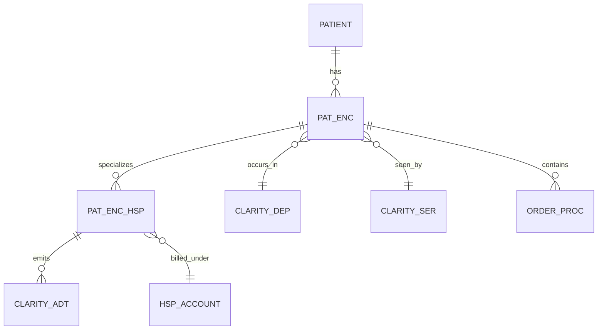
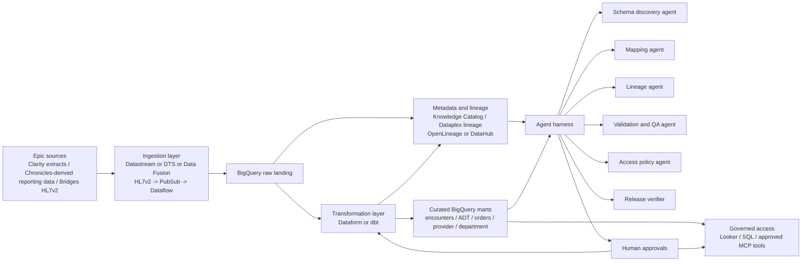
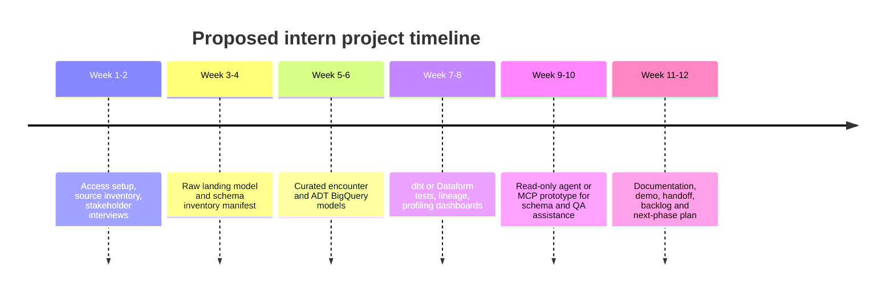
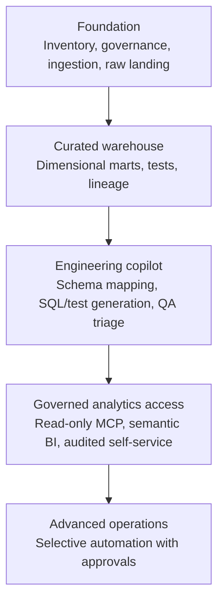

# Agentic Architectures for Epic to BigQuery Migration and Operations at Northwell Health

> **Status:** Research reference. This document is noncanonical and may be
> stale. Current requirements live in `docs/PRD.md`.

## Executive summary

For Northwell Health, an Epic-to-BigQuery program is not just a one-time database migration problem. It is a long-lived operating model problem: how to discover and normalize heterogeneous Epic data, preserve lineage, validate data quality, enforce PHI controls, and continuously evolve downstream analytics and AI products without making every change a bespoke engineering effort. Public evidence already shows that Northwell uses Google Cloud Healthcare APIs and BigQuery for clinical interoperability and AI use cases, and that Google Cloud remains an active healthcare platform for agentic systems and governed data access. That makes a BigQuery-centered modernization strategy plausible for Northwell even though public materials do **not** describe a full Northwell Epic-to-BigQuery migration program end to end. citeturn11view0turn10view0turn32search6turn31search5

The strongest conclusion from recent literature is that agentic workflows are now mature enough to assist with **metadata-heavy, reviewable, repetitive** healthcare data engineering tasks such as schema discovery, SQL generation, ontology mapping, lineage reconstruction, test generation, and governed analyst self-service. The literature is equally clear that these systems still need guardrails, tool restrictions, evaluation harnesses, and human oversight, especially in clinical settings and when they interact with protected data. Reliable deployment requires narrow tool scopes, auditable actions, controlled write paths, and simulation or benchmark-based evaluation before production rollout. citeturn8search0turn8search1turn8search2turn25search6turn21search0turn7search22turn22search1turn7search19

For Epic source data, the most defensible design is a layered platform: a **raw replication zone** that preserves source fidelity, a **harmonized relational layer** that standardizes keys, data types, and code sets, and a **curated semantic layer** that serves analytics, quality reporting, and agent tools. In practice, that means moving Clarity-style relational extracts into BigQuery via CDC or scheduled connectors, optionally landing HL7v2/FHIR messages through Cloud Healthcare API and Dataflow for interoperability use cases, and then using dbt or Dataform plus lineage/catalog tooling to build governed marts. BigQuery features such as partitioning, clustering, materialized views, row-level security, and column-level protection fit this pattern well. citeturn17search14turn17search15turn34search0turn17search9turn30search6turn30search8turn4search1turn4search5turn26search5turn5search0turn5search20

The recommended agentic architecture is **not** “let an LLM touch Epic directly.” It is a harnessed system in which specialist agents work against catalog metadata, read-only staging views, lineage APIs, test frameworks, and controlled MCP servers. In the near term, the highest-value uses are schema mapping proposals, SQL/transformation draft generation, lineage reconciliation, QA/test authoring, access policy suggestions, and change-impact analysis. The safest first implementation is a read-mostly internal engineering copilot with approval gates, then a governed analyst or BI copilot on curated BigQuery/Looker semantics, and only later limited write-capable operational automations. citeturn31search8turn31search17turn31search16turn20search1turn20search6turn32search14turn23search16turn23search9

The proposed intern project should therefore be scoped as a platform accelerant rather than a full migration owner role: build a metadata-driven migration harness for a defined Epic domain, such as encounters, ADT, orders, and provider/department dimensions; implement lineage and quality checks; demonstrate one small MCP-enabled agent workflow; and produce reusable documentation, test assets, and operating runbooks. That scope is realistic, low-risk, and useful even if Northwell’s exact internal Epic configuration differs from public examples. citeturn15search2turn14search17turn15search0turn14search0turn14search1turn14search24turn4search14turn24search2turn24search3

## What the evidence says about agentic workflows in healthcare data engineering

The foundational agent literature over the past five years established the technical building blocks that matter for healthcare data engineering. ReAct demonstrated interleaved reasoning and tool use; Toolformer formalized model-initiated API calls; and AutoGen showed that multi-agent conversation patterns can coordinate specialized roles. These are directly relevant to migration programs because migration work is itself a sequence of tool-mediated subtasks: inspect schema, translate logic, execute test query, compare output, repair transformation, and document lineage. citeturn8search0turn8search1turn8search2

Healthcare-specific research is more cautious. A 2024 Nature Digital Medicine perspective argued that LLM agents for clinical settings should be assessed in high-fidelity workflow simulations rather than only generic benchmarks. That matters here because an Epic migration agent can appear “correct” on text or SQL benchmarks while still causing operational harm through bad joins, code-set mismatches, or access mistakes. More recent healthcare reviews and benchmarks from 2025 to 2026 reinforce the same point: agentic systems are promising, but dependable evaluation, workflow grounding, and safety controls remain critical. citeturn25search6turn25search2turn25search1turn25search14turn25search17

The most directly relevant frontier research for healthcare data engineering is concentrated in five themes. First, **EHR text-to-SQL** is advancing quickly. The EHRSQL 2024 shared task formalized reliable text-to-SQL for electronic health records, and MedT5SQL plus later retrieval-augmented work show that schema retrieval and medical coding context materially improve performance. Second, **interactive EHR agents** are emerging: EHRAgent uses a code interface and multi-turn tool use for EHR reasoning tasks. Third, **secure clinical data access layers** are appearing: the recent M3 work describes self-describing tools and auditable SQL for clinical workflows. Fourth, **ontology-driven data harmonization** is becoming tractable: a 2026 study combining ontology retrieval and LLM validation reported 78% to 92% agreement with expert assessment for healthcare harmonization tasks. Fifth, **workflow-oriented healthcare agent frameworks** now emphasize reflection, memory, and tool restrictions rather than unrestricted autonomy. citeturn21search0turn21search14turn22search10turn7search22turn7search19turn22search0turn25search5

Taken together, that literature supports a practical rule for Northwell: use agentic systems to **propose, inspect, reconcile, and test** migration artifacts, but do not let them own clinical truth or unsupervised PHI-changing operations. In other words, an agent should draft a field map from `PAT_ENC_HSP` to a curated encounter fact table, propose partition and clustering columns, generate dbt or Dataform tests, and surface lineage gaps. It should not silently publish production schemas, widen access to sensitive columns, or write back to source systems. That recommendation is an inference from the research and platform documentation rather than a direct prescription from any one paper, but it is strongly supported by the combined evidence. citeturn7search22turn22search1turn25search6turn20search1turn31search9

Public industry examples also point in this direction. Google Cloud’s healthcare materials show Northwell using Healthcare APIs and BigQuery for interoperable clinical data and AI, Hackensack Meridian Health migrating Epic workloads to Google Cloud while using BigQuery and Looker as part of modernization, and Community Health Systems completing a Google Cloud data migration and then using BigQuery for real-time patient and operational insight. These examples are not detailed blueprints for Epic-to-BigQuery modeling, but they do show that major U.S. health systems are coupling EHR modernization with BigQuery-centered analytics and AI. citeturn11view0turn12search4turn12search7turn12search1

## Epic source systems and BigQuery target patterns

Epic’s public integration materials make two things clear. First, Epic operates a **federated model**: there is no central Epic endpoint, and each health system decides which connections and apps are allowed. Second, HL7v2 interfaces are commonly routed through an interface engine, with Bridges described by Epic as its core messaging infrastructure; historically, many HL7v2 connections used MLLP-style TCP/IP connectivity. For Northwell, that means any migration or interoperability program must assume customer-specific connectivity, security, and data availability decisions rather than a universal Epic export path. citeturn16search4turn16search2turn16search3

Public official technical documentation for some Epic internals is limited. Epic’s EHI Export schema and open interface documentation are public, but much deeper technical detail for products such as Clarity and Caboodle often sits behind Epic’s UserWeb or customer training resources. Public sources do confirm the Epic product names, expose many Clarity-style table definitions through the EHI export documentation, and identify Caboodle in official Epic materials as Epic’s enterprise data warehouse. For this reason, any public analysis of Caboodle and Chronicles should be treated as partial, and production planning should validate all model assumptions against Northwell’s own Epic version, modules, and customizations. citeturn3search6turn15search6turn3search22turn3search3

For analytics and migration planning, the most useful publicly documented Epic-relational objects include:

| Epic object | Publicly documented role | Why it matters for BigQuery | Primary sources |
|---|---|---|---|
| `PATIENT` | One record per patient with demographics and registration-related attributes | Core patient dimension or master identity reference | citeturn14search17 |
| `PAT_ENC` | One record per patient encounter, including appointments, office visits, phone encounters, and more | General encounter grain for ambulatory and mixed-use analytics | citeturn14search2turn15search4 |
| `PAT_ENC_HSP` | Primary table for hospital encounter information created through ADT workflows | Inpatient, ED, and hospital encounter fact table basis | citeturn15search0 |
| `CLARITY_ADT` | Master table for ADT event history with foreign keys to other ADT tables | Admission-transfer-discharge event fact/event stream | citeturn15search2 |
| `HSP_ACCOUNT` | Hospital account information | Hospital billing/HAR dimension and revenue-cycle joins | citeturn15search1 |
| `ORDER_PROC` | Procedures ordered in the clinical system with patient and contact IDs | Orders/procedures fact table | citeturn14search0 |
| `CLARITY_DEP` | High-level information about departments | Department dimension | citeturn14search1 |
| `CLARITY_SER` | High-level information about provider records | Provider/resource dimension | citeturn14search24turn15search3 |
| Bridges HL7v2 interfaces | Epic’s messaging infrastructure for outgoing and incoming HL7v2 | Near-real-time event ingestion, supplemental ops feeds, and interoperability | citeturn16search2turn16search3 |

Because Epic documentation is customer-specific, the most robust BigQuery design is a **three-layer target schema** rather than a single heroic target model. In the **raw layer**, source tables are preserved with source names, source keys, load timestamps, and minimal coercion. In the **harmonized layer**, keys are normalized, local/value-coded columns are documented, repeated “extension” tables are conformed, and source-system quirks are handled explicitly. In the **curated layer**, domain-specific facts and dimensions are built for analytics, BI, population health, or interoperability outputs such as FHIR or OMOP-adjacent views. This pattern aligns with BigQuery’s schema design guidance, partitioning and clustering capabilities, nested/repeated support where appropriate, and staged migration methodology. citeturn4search20turn4search0turn4search16turn4search1turn4search5

The practical mapping pattern is usually:

In BigQuery, the raw equivalents can remain close to Epic table structure, but the curated layer should usually separate **event facts** from **slowly changing dimensions** and provide explicit date fields for partitioning. For example, `fact_hospital_encounter` can be partitioned by admission or discharge date and clustered by high-selectivity fields such as patient ID, department ID, provider ID, or encounter/account identifiers; `dim_patient`, `dim_provider`, and `dim_department` remain smaller conformed dimensions; and `fact_adt_event` captures transfer history at event grain. This recommendation follows from the Epic table definitions and BigQuery guidance on partitioning, clustering, and materialized views. citeturn15search0turn15search2turn14search17turn14search1turn14search24turn4search1turn4search5turn26search5

For ingestion and migration, the connector choice depends on whether the Northwell source of truth is primarily relational Epic reporting data, interface traffic, or standards-based healthcare records.

| Path | Best fit | Strengths | Limitations | Primary sources |
|---|---|---|---|---|
| Datastream to BigQuery | Continuous CDC from Clarity databases or adjacent SQL Server/Oracle stores | Native near-real-time replication into BigQuery; supports SQL Server and Oracle | Requires CDC setup and source compatibility; relational replication is not domain-semantic by itself | citeturn17search14turn17search15turn17search4turn17search5turn17search21 |
| BigQuery Data Transfer Service | Scheduled pulls from SQL Server or Oracle | Managed recurring transfers with less operational code | Better for scheduled ingestion than event CDC; less control than custom pipelines | citeturn34search4turn34search0turn17search9turn34search14 |
| Cloud Data Fusion replication | CDC from SQL Server/Oracle using Datastream-powered replication jobs | More GUI-driven replication workflow; viable when integration teams prefer managed ETL UX | Adds another control plane; still not a semantic healthcare model | citeturn34search11turn17search1 |
| Cloud Healthcare API HL7v2 plus Pub/Sub plus Dataflow | Near-real-time clinical message ingestion from Epic/Bridges | Strong for event-driven interoperability, HL7v2 parsing, and FHIR transforms | HL7v2 is message-centric, not a substitute for full Clarity/Caboodle-style analytics history | citeturn34search2turn34search3turn30search18turn30search20 |
| Cloud Healthcare API FHIR export or streaming to BigQuery | Standards-based patient longitudinal record or downstream interoperable analytics | Direct BigQuery export/streaming from FHIR stores; good for agent and analytics access to standardized resources | Requires FHIR conversion/governance; not a direct mirror of Epic relational analytics tables | citeturn30search6turn30search8turn17search7turn30search3 |

The case-study takeaway is that most hospitals will need **both** relational ingestion and standards-based interoperability. Relational Epic data remains essential for operational reporting and finance, while HL7v2/FHIR pipelines add real-time exchange and standardized downstream consumption. Northwell’s own public Google Cloud story emphasizes interoperable aggregation and clinician-facing insight delivery rather than a pure warehouse lift-and-shift, which supports a hybrid design. citeturn11view0turn30search6turn34search2

## Recommended agentic architecture, harnesses, and MCP usage

The most useful architectural distinction is between **orchestration** and **agentic assistance**. Orchestration manages deterministic execution order, retries, schedules, and environments. Agents manage ambiguity: inspecting metadata, translating logic, choosing tools, reconciling mismatches, and drafting artifacts for approval. In an Epic migration, deterministic tasks belong in Airflow, Dagster, Prefect, Dataform, or dbt; probabilistic tasks belong in a harnessed agent layer with strict inputs and outputs. citeturn19search19turn19search4turn19search1turn24search13turn19search2turn24search3

A strong reference design for Northwell is a **planner–specialist–verifier harness**. The planner decomposes work by domain and environment. Specialist agents then operate only on specific tool surfaces: catalog metadata, table schemas, lineage APIs, read-only BigQuery views, test runners, and policy registries. A verifier agent or deterministic rule engine compares generated outputs against source constraints and acceptance checks before anything is promoted. This pattern is consistent with the broader agent literature, healthcare evaluation guidance, and platform-level support for tracing and observability. citeturn8search0turn8search2turn25search6turn23search9turn23search16

The specialist roles can be defined as follows.

| Agent or harness component | Inputs and tools | Output | Hard guardrails |
|---|---|---|---|
| Schema discovery agent | Epic table metadata, sample profiles, catalog entries, source DDL, EHI table definitions | Source inventory, candidate entities, key suggestions, data type issues | Read-only only; no production query permissions beyond sampling |
| Mapping agent | Source metadata plus target semantic model and code lists | Field-level source-to-target mappings, draft transformation SQL | Cannot publish directly; every mapping gets deterministic tests |
| Lineage agent | SQL manifests, Dataform/dbt metadata, Dataplex lineage, OpenLineage/DataHub APIs | Table and column lineage graph, blast-radius reports | No schema changes; reconcile only against existing metadata systems |
| Validation and QA agent | Row counts, profiling outputs, test failures, sampled diffs | Data-quality triage, suggested fixes, new assertions | No source writes; limited to issue creation and patch proposals |
| Access policy agent | Data classifications, PHI tags, IAM templates, role matrices | Suggested row/column policies, masking recommendations, access change diffs | All access changes require human approval and change tickets |
| Release verifier | Test suites, observed lineage, policy checks, cost/perf metrics | Promotion recommendation or block reason | Deterministic promotion rules override model preference |

Those capabilities map naturally to modern agent frameworks.

| Tooling category | Best options for this use case | Why |
|---|---|---|
| Agent framework | Google ADK or Gemini Enterprise Agent Platform when Google-centric; LangGraph when maximum control is needed; OpenAI Agents SDK for lightweight orchestration; CrewAI when teams prefer higher-level multi-agent abstractions | ADK is explicitly designed to build, evaluate, and deploy enterprise agents and works naturally with Google-managed MCP servers; LangGraph is strong for long-running stateful agents; OpenAI Agents SDK is lightweight and provider-aware; CrewAI is productive but more opinionated. citeturn32search0turn32search1turn32search14turn18search0turn18search8turn18search7turn18search1 |
| Workflow orchestration | Airflow / Cloud Composer for mature batch governance; Dagster for asset-centric observability; Prefect for Python-first simplicity | Migration backfills and nightly reconciliations need deterministic orchestration, not just agent loops. Airflow is proven; Dagster adds asset awareness and integrated lineage context; Prefect is faster to start. citeturn19search19turn19search15turn19search4turn19search16turn19search1 |
| SQL transformation and testing | dbt or Dataform | Both support testable SQL pipelines; dbt has strong unit/data tests and documentation, while Dataform is native to BigQuery and supports assertions. citeturn24search3turn19search2turn19search6turn24search13turn24search2 |
| Lineage and metadata | Dataplex/Knowledge Catalog first, optionally extended with OpenLineage and DataHub or OpenMetadata | BigQuery lineage is available natively, while open standards help span non-Google systems and provide richer column-level or cross-platform metadata. citeturn4search2turn4search14turn4search18turn33search0turn33search4turn33search12 |
| LLM observability and evaluation | LangSmith, ADK evaluation/tracing, or platform-native observability | Agent reliability is a first-class problem; tracing and benchmarked evaluations are necessary before rollout. citeturn23search9turn23search16turn32search11turn32search2 |

MCP is useful here, but only when used as a **governed tool surface**, not as an unrestricted super-connector. The MCP specification defines a host-client-server architecture for exposing tools, prompts, and resources. Google Cloud now offers managed MCP servers, including BigQuery support, with IAM controls, audit logging, Cloud Trace integration, toolset scoping, deny policies, and controls to prevent read-write tool use; OpenAI documents remote MCP support and connectors as another integration path. For Northwell, the most sensible use is a **read-only BigQuery MCP surface** over curated datasets and approved SQL tools, plus perhaps a Looker or catalog MCP surface later. citeturn20search12turn20search6turn31search5turn31search8turn31search17turn31search16turn31search21turn31search9turn31search12turn20search5

## Security, PHI, governance, and performance

Any Northwell implementation must begin with the legal baseline: HIPAA’s Privacy Rule protects PHI, the Security Rule requires administrative, physical, and technical safeguards for electronic PHI, and the minimum necessary standard requires reasonable efforts to limit use and disclosure to what is needed for the intended purpose. HHS also makes clear that de-identified information, once properly de-identified under HIPAA, is no longer PHI for HIPAA purposes, though re-identification risk still needs practical governance attention. citeturn28search9turn28search5turn28search3turn28search1turn28search8

On Google Cloud, signing the BAA is necessary but not sufficient. Google’s HIPAA materials state that covered entities are responsible for configuring compliant solutions on covered services; the Cloud Healthcare API is explicitly covered under the Google Cloud HIPAA BAA; and Google provides multiple healthcare-specific controls including Healthcare API IAM, FHIR access control, FHIR Consent-based controls, Sensitive Data Protection, and Assured Workloads options for healthcare and life sciences. In other words, compliance is an architecture-and-operations discipline, not an automatic property of using BigQuery or Healthcare API. citeturn6search1turn6search8turn27search23turn5search19turn5search7turn5search15turn27search6turn27search13

For data-access governance in BigQuery, the primary controls are IAM, row-level security, column-level security through policy tags, and masking/de-identification workflows where analytics does not require direct identifiers. BigQuery documentation explicitly supports row-level security and column-level protection, while Sensitive Data Protection can scan BigQuery and de-identify data using techniques such as masking, tokenization, pseudonymization, and date shifting. For mixed structured and healthcare-standard workflows, Cloud Healthcare API de-identification on FHIR stores can complement warehouse-side controls. citeturn5search0turn5search4turn5search16turn5search20turn27search0turn27search9turn27search12turn27search1turn27search3

For agentic or MCP-enabled access, the control pattern should be stricter than standard BI access. Google Cloud’s MCP documentation supports IAM-based controls, deny policies based on tool properties or OAuth client IDs, audit logging, and controls to block write-capable tools. The official MCP security guidance also recommends robust consent and authorization flows, clear documentation of implications, and strong access protections. Applied to Northwell, that means: no broad SQL execution against raw datasets; no unrestricted schema discovery across all projects; separate service identities for agents; explicit “read-only by default” tool catalogs; and human approval for any access or schema mutation. citeturn31search17turn31search16turn31search13turn20search1turn20search4

Performance design should follow BigQuery’s documented strengths rather than import on-prem assumptions. Google recommends staged migration, explicit schema specification, partitioning and clustering, materialized views for repeated expensive logic, and workload reservations when you need capacity isolation or predictable performance. BigQuery also documents that BI Engine performs best with pre-joined or pre-aggregated tables and a small number of joins, which is directly relevant to Caboodle-like analytics marts. For healthcare data, that implies keeping a faithful raw layer for auditability while also building denormalized marts for common quality, throughput, and executive dashboards. citeturn4search20turn4search0turn4search1turn4search5turn26search5turn26search12turn26search9turn26search18

The governance fabric should also include lineage everywhere possible. BigQuery and Knowledge Catalog support lineage tracking for BigQuery tables; open standards such as OpenLineage can extend lineage across airflow-style jobs; and metadata platforms such as DataHub or OpenMetadata can layer discovery, ownership, documentation, policy context, and column-level relationships across the full data estate. In a migration setting, lineage is not just a nicety. It is how you defend accuracy, explain change, and bound the blast radius when a source field moves or a transformation is corrected. citeturn4search14turn4search2turn33search0turn33search4turn33search12

## Proposed intern project scope

A well-scoped intern project should focus on one domain slice with high visibility and tractable complexity. A strong candidate is **encounter and ADT migration acceleration**, built around `PATIENT`, `PAT_ENC`, `PAT_ENC_HSP`, `CLARITY_ADT`, `CLARITY_DEP`, and `CLARITY_SER`. That slice touches patient identity, hospital flow, provider attribution, and location context without requiring the intern to solve every finance, clinical documentation, and claims edge case simultaneously. It also maps nicely to public Epic EHI documentation and BigQuery warehousing patterns. citeturn14search17turn14search2turn15search0turn15search2turn14search1turn14search24

The project objective should be to produce a **reusable migration harness**, not just a one-off pipeline. That means four deliverables: a source-to-target mapping workbook or manifest, automated profiling and quality checks, lineage capture across raw-to-curated transformations, and one small governed agent workflow that helps engineers inspect mappings or test failures. The intern’s artifact should be useful even if Northwell changes the exact target semantic model later. citeturn24search3turn24search2turn4search14turn31search8

A concrete twelve-week scope looks like this:

| Phase | Deliverables | Skills required | Success metrics |
|---|---|---|---|
| Discovery | Inventory of source tables, keys, refresh cadence, and known consumers | SQL, data modeling, stakeholder interviewing | Approved source inventory; open issues logged |
| Build raw layer | BigQuery raw schemas and load jobs for encounter/ADT slice | BigQuery, ingestion tooling, CI/CD basics | Successful repeatable loads; source-fidelity checks pass |
| Build curated layer | Encounter fact, ADT fact, patient/provider/department dimensions | Dimensional modeling, dbt or Dataform | Queryable mart supports agreed business questions |
| Add reliability | Data tests, profiling, lineage, reconciliation notebook or dashboard | dbt/Dataform tests, metadata, Python | >95% critical tests pass; lineage visible for target tables |
| Add agent harness | Read-only schema/QA copilot using approved tools | Agent framework, prompt/tool design, observability | Time-to-diagnose common failures reduced; no unauthorized actions |
| Handoff | Runbook, architecture doc, backlog, demo | Technical writing, presentation | Team can run and extend project without intern |

Recommended tooling for the intern, assuming no internal constraints are imposed, is pragmatic rather than maximalist: BigQuery; either dbt or Dataform for transformations and tests; Dataplex/Knowledge Catalog lineage; Python plus `google-cloud-bigquery`; optionally SQLGlot for SQL parsing and normalization; and either ADK or LangGraph for a small read-only harness. Great Expectations or Soda can be added if the team already prefers one of them, but the minimum viable project can stay lean by relying first on dbt/Dataform assertions and platform lineage. citeturn24search13turn24search2turn24search3turn4search14turn33search2turn32search0turn18search0turn24search0turn24search1

## Prioritized roadmap and risk management

The implementation roadmap should be phased by **risk and reversibility**, not by how exciting the AI is. The first phase is migration substrate and governance: source inventory, ingestion choice, tagging/classification, raw landing, curated schemas, tests, and lineage. The second phase is internal engineering acceleration: schema discovery copilot, mapping assistant, SQL/test generation, diff review, and QA triage. The third phase is governed analyst enablement: curated semantic marts, possibly Looker semantic access, and read-only MCP access to approved tools. Only later should Northwell consider write-capable operational agents or broader natural-language querying over sensitive domains. This ordering follows the literature and platform documentation: successful healthcare agents depend on evaluated workflows, tool limits, and governed context. citeturn25search6turn25search17turn31search8turn31search17turn23search16

A concise roadmap is:

The major risks and mitigations are straightforward.

| Risk | Why it matters | Mitigation |
|---|---|---|
| Public documentation mismatch with Northwell’s Epic build | Epic versions and customizations vary by customer | Validate every mapping against Northwell-side metadata and SMEs before go-live; treat public docs as a starting point only. citeturn15search6turn16search4 |
| LLM hallucination in schema mapping or SQL | Can produce silent analytical errors | Require deterministic tests, sampled reconciliations, and verifier gates before promotion. citeturn21search0turn25search6turn23search16 |
| Overbroad PHI exposure via agents or MCP | Security and compliance risk | Use read-only tools, IAM deny policies, column and row controls, masking, and audit logging. citeturn31search17turn31search16turn5search0turn5search20turn27search0 |
| Poor performance from directly mirroring highly normalized schemas | BigQuery can query them, but common analytics may remain slow and expensive | Keep raw fidelity but build curated marts, clustering, partitioning, and materialized views for repeated workloads. citeturn4search1turn4search5turn26search5turn26search18 |
| Incomplete lineage and impact analysis | Makes changes hard to trust | Turn on platform lineage early; supplement with OpenLineage or catalog tooling if cross-platform visibility is needed. citeturn4search14turn33search0turn33search4 |
| Treating interoperability feeds as a full analytics warehouse | HL7v2/FHIR pipelines do not automatically replace Clarity-style financial and operational history | Use hybrid architecture: relational warehouse replication plus standards-based event and FHIR layers. citeturn34search2turn30search6turn15search1turn14search0 |

The best near-term architecture decision for Northwell is therefore a **hybrid, metadata-first, BigQuery-centered platform with harnessed agents**. Build the relational migration backbone first. Add interoperability pipelines where real-time exchange matters. Put a curated semantic layer in front of downstream users. Then introduce agents only through explicit tool contracts, tests, and approvals. That is the design most consistent with current evidence, official product capabilities, and healthcare governance realities. citeturn11view0turn17search14turn30search6turn31search8turn32search14

## Open questions and limitations

This report intentionally prioritizes primary and official public sources. The main limitation is that **Epic public technical documentation is incomplete** for several customer-facing analytics internals, especially deeper Caboodle and Chronicles implementation details. Epic’s public EHI table documentation and interface materials are useful, but a production migration plan still needs Northwell-specific access to Epic UserWeb, local schema catalogs, source DBA input, and application-owner review before any field-level mapping is treated as authoritative. citeturn3search3turn15search6turn16search4

Public Northwell material confirms use of Google Cloud Healthcare APIs and BigQuery, but it does **not** publicly document a comprehensive Northwell Epic-to-BigQuery program, source-system list, governance model, or chosen ingestion tooling. The architecture and roadmap here should therefore be treated as a high-confidence reference design for a large U.S. Epic health system on Google Cloud, not as a claim about Northwell’s current internal implementation. citeturn11view0turn10view0
